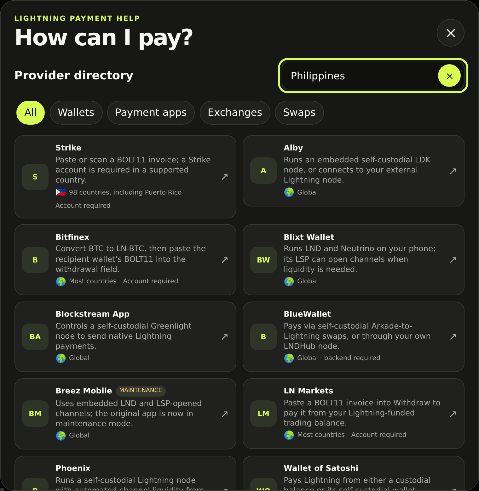

# Lightning Pay Kit

A small React component that sits beside a BOLT11 invoice and answers one
question: **How can I pay?**

[Live demo](https://pseudozach.github.io/lightning-pay-kit/) · [npm](https://www.npmjs.com/package/lightning-pay-kit) · [Contributing](CONTRIBUTING.md)



It offers a searchable, country-aware directory of wallets, payment apps, exchanges, and any
independently verified swap routes. It is deliberately not a wallet connector
or payment processor.

## Scope and guarantees

- No WebLN, NWC, WalletConnect, custody, balance access, automatic payment, or
  wallet-specific custom URI schemes.
- Provider-page actions emit only `status: "handed_off"`. They never mean the
  invoice was paid. Settlement remains the host backend's responsibility.
- No telemetry, remote registry, runtime CDN, remote image, or project-server
  request. Invoice parsing and provider filtering happen locally.
- Provider destinations are credential-free HTTPS URLs. Named rows say to copy
  the invoice and open instructions/site; they never imply invoice injection.

Before showing provider actions, the package checks bounded Bech32
encoding/checksum, known network, required field cardinality, and expiry. It is
not a full BOLT11 signature or payment validator; the receiving wallet and
merchant backend remain the authorities.

## Install

Install the published package from npm:

```bash
npm install lightning-pay-kit
```

For workspace development:

```sh
pnpm install
pnpm build
```

Peer support: React and React DOM 17, 18, or 19. The package uses no React 18-only
runtime APIs; a packed React 17 consumer is part of the release verification.

Import the stylesheet once in the host application:

```tsx
import { LightningPaymentHelp } from "lightning-pay-kit";
import "lightning-pay-kit/styles.css";

export function InvoiceHelp({ invoice }: { invoice: string }) {
  return <LightningPaymentHelp invoice={invoice} />;
}
```

Use `trigger="button"` for a text button or omit it for the compact `?` trigger.

## SMS4Sats integration

The existing invoice string can be passed directly; no adapter or server route
is needed:

```tsx
<LightningPaymentHelp
  invoice={invoice}
  trigger="button"
  onHandoff={(event) => {
    // event.status is always "handed_off", never "paid".
  }}
/>
```

The [playground integration](apps/playground/src/main.tsx)
uses a synthetic regtest-format fixture and performs no app launch or payment.

## Headless/controlled use

```tsx
import {
  LightningPaymentModal,
  useLightningPaymentHelp,
} from "lightning-pay-kit";

function CustomHelp({ invoice }: { invoice: string }) {
  const help = useLightningPaymentHelp();
  return (
    <>
      <button onClick={help.open}>Your own trigger</button>
      <LightningPaymentModal
        invoice={invoice}
        isOpen={help.isOpen}
        onClose={help.close}
      />
    </>
  );
}
```

Core helpers and provider types are re-exported from `lightning-pay-kit`. The
workspace core package is private implementation structure and is not required
or published separately.

## Affiliate configuration

The bundled FixedFloat route uses the disclosed default destination
`https://ff.io/?ref=pmdxabka`. It renders an `Affiliate` badge and
`rel="sponsored noopener noreferrer"`; it does not affect filtering, visibility,
or organic order.

Replace the destination—or opt out and use FixedFloat's plain URL—with host
configuration:

```tsx
<LightningPaymentHelp
  invoice={invoice}
  affiliateOverrides={{
    fixedfloat: {
      url: "https://ff.io/?ref=your-code",
      disclosure: "Affiliate",
    },
    // Use `fixedfloat: null` instead to disable the bundled referral.
  }}
/>
```

All affiliate destinations must be credential-free HTTPS URLs. Overrides replace
only the destination of the matching record and cannot make an unverified
provider visible.

## Provider database

The canonical, version-controlled database is
[`packages/core/src/data/providers.json`](packages/core/src/data/providers.json),
with a machine-readable
[JSON Schema](packages/core/src/data/providers.schema.json). Every record includes
plain-language capability copy, structured Lightning mechanisms, current status,
review dates, and evidence provenance; every visible verified route is backed by
current first-party evidence, while hidden research candidates may retain clearly
identified community discovery sources.
Consumers can use the raw GitHub file or the npm exports
`lightning-pay-kit/providers.json` and
`lightning-pay-kit/providers.schema.json`. The current database retains **59**
researched records while showing only **30** verified, usable routes. Country
searches prioritize explicitly local providers, include available global
providers, and respect structured exclusions; this keeps plausible candidates
auditable without presenting them as working payment paths.
See [docs/PROVIDER_DATA.md](docs/PROVIDER_DATA.md) for the evidence model,
directory assessment, raw URLs, and maintenance policy.

A scheduled GitHub workflow checks every action/evidence link weekly and flags
records older than 90 days in a review issue. It never rewrites factual claims or
publishes a provider automatically; evidence changes remain reviewable pull
requests.

## Provider policy

The bundled database is conservative and local—there is no runtime registry.
Verified active/maintenance records are shown; records marked
`needs_reverification`, unknown, suspended, or retired are hidden by default.
Every visible card explains how the provider actually pays Lightning (for
example a custodial balance, embedded or hosted node, remote node, exchange
withdrawal, or swap) instead of exposing internal taxonomy.

See [CONTRIBUTING.md](CONTRIBUTING.md) for the evidence
required by a provider submission and
[docs/DEPENDENCY_DECISIONS.md](docs/DEPENDENCY_DECISIONS.md)
for the OpenReceive evaluation.

## Contributing

Pull requests are welcome to add, remove, verify, or improve database records,
and to improve the package, tests, documentation, and accessibility. Provider
changes should include current first-party evidence and preserve the fail-closed
visibility policy.

## Security and privacy

Provider text is rendered as text, never injected HTML. Core and data imports
have no DOM, storage, timer, locale, or network side effects. External provider
navigation requires an explicit user click.

Read [SECURITY.md](SECURITY.md) for the threat model.

## Development and verification

```sh
pnpm lint
pnpm typecheck
pnpm test
pnpm build
pnpm check:ssr
pnpm check:package
pnpm check:react17-next12
pnpm e2e
```

The Playwright suite covers a 320 px mobile sheet and 1280 px desktop dialog,
focus/Escape behavior, axe, and unexpected runtime requests.

> **Referral note:** If a host does not replace or disable the bundled FixedFloat
> referral, the original project developer may earn referral rewards. FixedFloat
> controls its own rates and fees. This never affects provider visibility or
> ranking.

## License

Source code is MIT. Provider names and trademarks remain their owners' property
and are excluded from the license grant. No third-party logos are shipped. See
`TRADEMARKS.md` and `THIRD_PARTY_NOTICES.md`.
